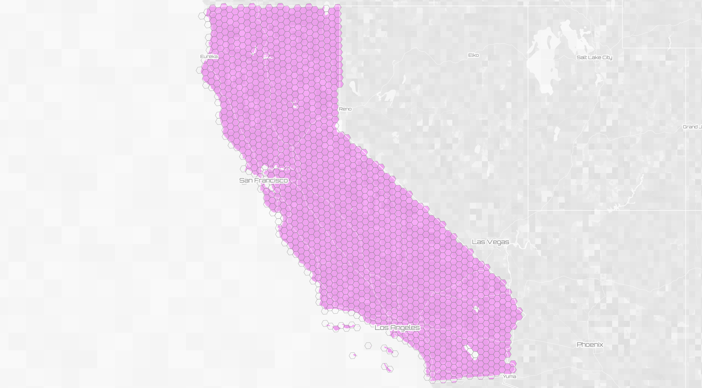
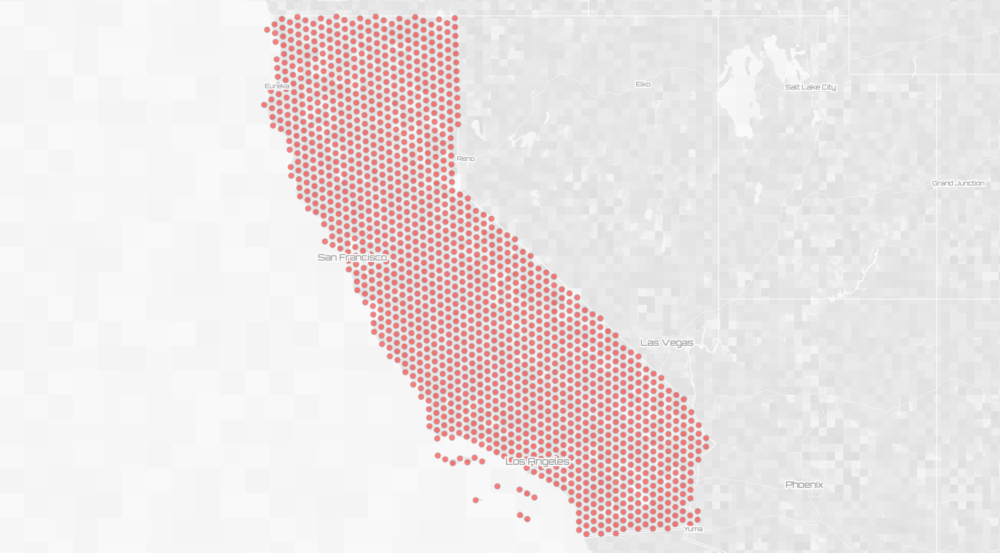
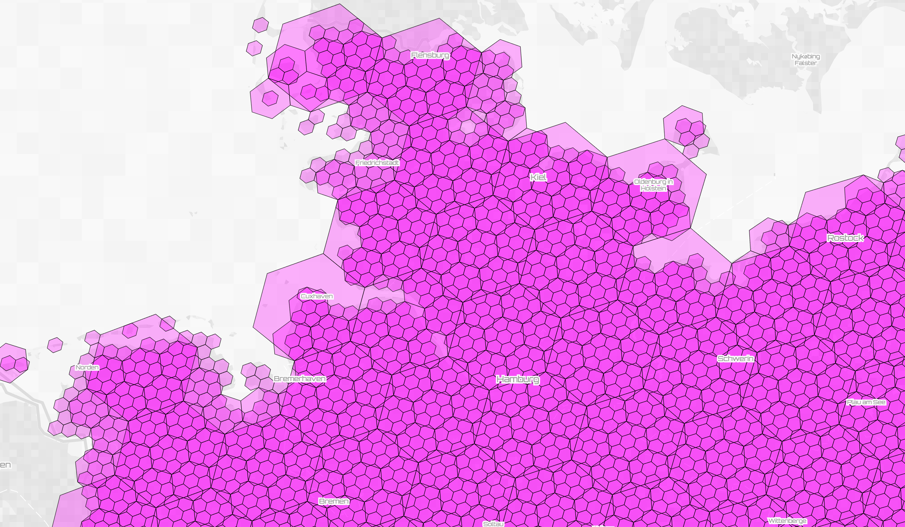
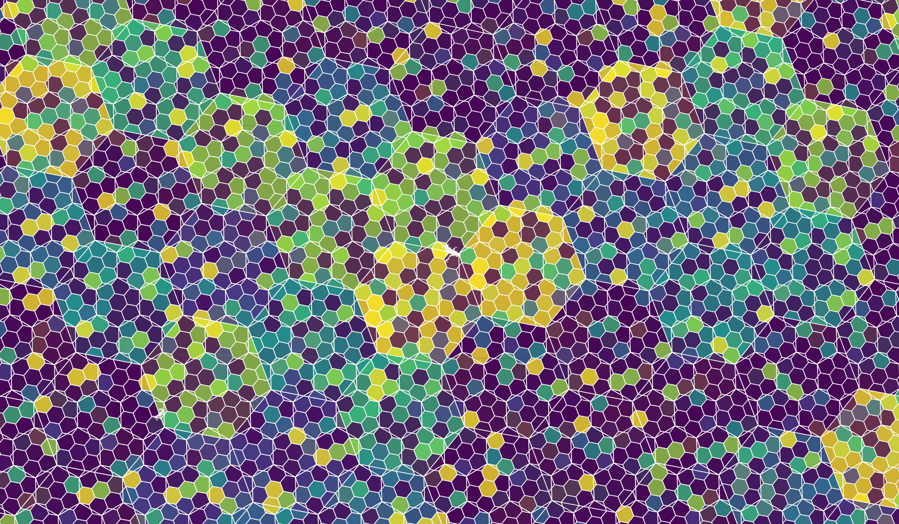
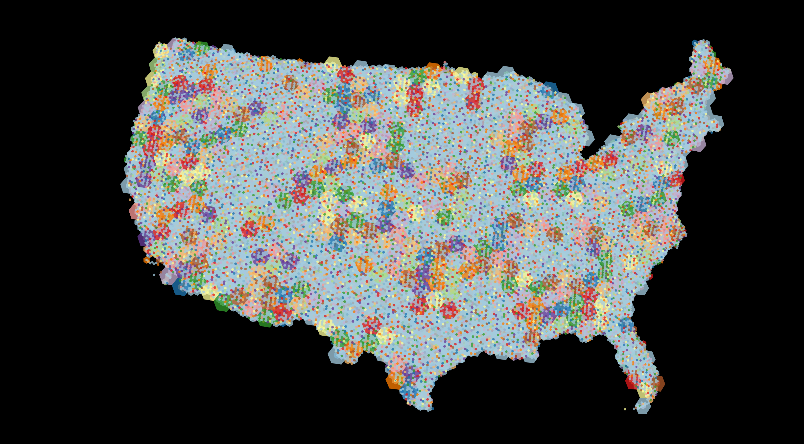

# wof2h3

This node.js script takes a WOF ID and an H3 resolution as input and generates an H3 hexgrid that fills the geometry specified by the WOF ID (city, region, country, continent...) It saves the hexbin grid and their centroids to two GeoJSON files.
```
  $ node wof2h3.mjs 85688637 6
  WOF ID 85688637 California
  10997 hexbins
```

This will generate two files named `wofid_wofname_h3resolution_kind.geojson`

- [85688637_California_6_h3_hexagons.geojson](data/85688637_California_6_h3_hexagons.geojson)
- [85688637_California_6_h3_centroids.geojson](data/85688637_California_6_h3_hexagons.geojson)

The feature IDs of the hexbins are the h3 IDs.




If an `alt_mapzen` [alternate geometry](https://whosonfirst.org/docs/geometries/alt/) is available, it will be used instead of the default WOF geometry. (Sorry Farallons.)

## What is this for?

I made this with the idea that high resolution H3 grids could be viewed at lower map zoom levels to create a dot density map or a pseudo heat map.  It's also interesting to see how h3 hexbins stack at different resolutions. 


[link](https://s3.amazonaws.com/xyz-demo/scenes/xyz_tangram/index.html?space=cQMGVs2y&token=AKkz6TS4RG6piCQnWro2gAA&basemap=xyz-pixel&projection=mercator&demo=0&vizMode=xray&buildings=1&pattern=&patternColor=%2384c6f9&points=9&lines=0&outlines=3&places=1&roads=0&clustering=0&quadCountmode=mixed&quadRez=4&hexbins=0&voronoi=0&delaunay=0&water=1&tags=85633111_germany_4_h3_hexbins%2C85633111_germany_5_h3_hexbins%2C85633111_germany_6_h3_hexbins&property=%40ns%3Acom%3Ahere%3Axyz.uuid&palette=colorBrewerBlue&paletteFlip=true&sort=values&hideOutliers=false&pointSizeProp=&pointSizeRange=%5B4%2C20%5D&propertySearch=%7B%7D#8.604166666666686/54.0643/9.5771)



And the h3 grid makes much more sense when you [don't use web mercator](https://s3.amazonaws.com/xyz-demo/scenes/xyz_tangram/index.html?space=mo5hYdrg&token=AImxjR4_RQqThipP0YT4agA&basemap=xyz-reduction-light&projection=globe&demo=0&vizMode=property&buildings=1&pattern=&patternColor=%2384c6f9&points=9&lines=0&outlines=2&places=0&roads=0&clustering=0&quadCountmode=mixed&quadRez=4&hexbins=0&voronoi=0&delaunay=0&water=1&tags=102191575_north_america_3_h3_hexbins&palette=viridis&paletteFlip=false&sort=count&hideOutliers=false&pointSizeProp=&pointSizeRange=%5B4%2C20%5D&propertySearch=%7B%7D#4.675000000000004/44.009/-98.993)


But it also looks cool as just a space-filling pattern.



## Questions:

I don't really know what I'm doong with node.js and got this to work through brute force and desperation and coffee and IPA. A few questions:

- Why did I need to `.mjs` and `import` instead of `const`? 
- How do I package this so you don't have to run around and grab dependencies?

## dependencies

[h3.js](https://github.com/uber/h3-js)
[geojson2h3](https://github.com/uber/geojson2h3)
'fs','node-fetch','minimist' (for argv)

[You can dig in using Space Invader](https://s3.amazonaws.com/xyz-demo/scenes/xyz_tangram/index.html?space=zCOXmZmy&token=AE91crC4SyWB3zCSeH3HWwA&basemap=xyz-pixel&projection=mercator&demo=0&vizMode=xray&buildings=1&pattern=&patternColor=%2384c6f9&points=9&lines=0&outlines=2&places=1&roads=1&clustering=0&quadCountmode=mixed&quadRez=4&hexbins=0&voronoi=0&delaunay=0&water=0&tags=85688637_california_5_h3_hexagons&palette=viridis&paletteFlip=false&sort=count&hideOutliers=false&pointSizeProp=&pointSizeRange=%5B4%2C20%5D&propertySearch=%7B%7D#6.6833333333333345/37.416/-119.648)
